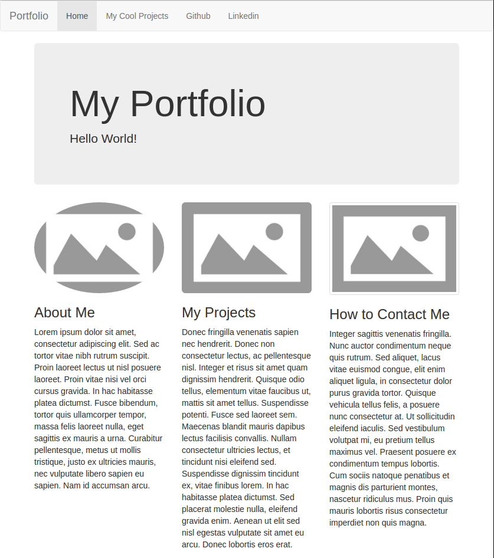
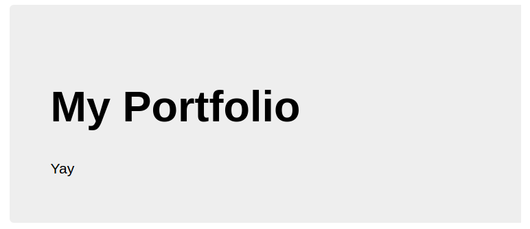
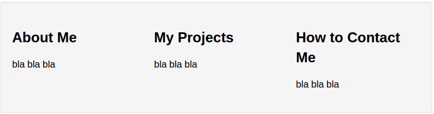
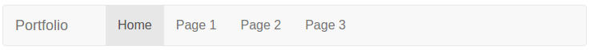

# Bootstrap Workshop

This is a workshop for Hack Club showing how to use bootstrap to make a cool portfolio.

Make sure you allready know how to setup a github page and use the cloud9 editor.



## Outline

1. Setup project
2. Go through using bootstrap features
3. Introduce to documentation and w3 schools bootstrap examples
4. Celebrate! 

### Setup

First make a new project with [cloud9](https://c9.io/). Then make a new file named `index.html`. Add the following code to the file, doing this will set a webpage title and allow us to use bootstrap.
```html
<!DOCTYPE html>
<html lang="en">
<head>
  <title>YOUR TITLE GOES HERE</title>
  <meta charset="utf-8">
  <meta name="viewport" content="width=device-width, initial-scale=1">
  <link rel="stylesheet" href="https://maxcdn.bootstrapcdn.com/bootstrap/3.3.6/css/bootstrap.min.css">
  <script src="https://maxcdn.bootstrapcdn.com/bootstrap/3.3.6/js/bootstrap.min.js"></script>
</head>
<body>
  <div class="container">
    <!-- HERE WE WILL PUT OUR PAGE CONTENT -->
  </div>
</body>
</html>
```


### Adding Bootstrap Elements

#### Jumbotron

First add a jumbotron, a big box for calling extra attention to some special content or information:



```html
<div class="jumbotron">
  <h1>TITLE GOES HERE</h1>
  <p>DESCRIPTION GOES HERE</p>
</div>
```

Add the above code to the `<div class="container"></div>` you created. Put your title and a description inside the `<h1>` element and `<p>` element.

You now have a jumbotron! You can press "Preview" then "Live Preview File" to see your page.

[[Bootstrap Documentation](http://getbootstrap.com/components/#jumbotron)]
[[W3 Schools Documentation](http://www.w3schools.com/bootstrap/bootstrap_jumbotron_header.asp)]

#### Columns
  


**TODO** Write tutorial for this

```html
<div class="row">
  <div class="col-xs-4">
    <h3>About Me</h3>
    <p>bla bla bla</p>
  </div>
  <div class="col-xs-4">
    <h3>My Projects</h3>
    <p>bla bla bla</p>
  </div>
  <div class="col-xs-4">
    <h3>How to Contact Me</h3>
    <p>bla bla bla</p>
  </div>
</div>
```
You can grab some natural-looking filler text [here](http://www.lipsum.com/)

[[Bootstrap Documentation](http://getbootstrap.com/css/#grid)]
[[W3 Schools Documentation](http://www.w3schools.com/bootstrap/bootstrap_grid_system.asp)]
  
#### Styled Images
  


Using bootstrap you can style images by adding a class to the img element.

```html

```

The above img element is styled to look like a thumbnail since it has a `img-thumbnail` class. There are other image classes you can use, you can see them in the below links.

[[Bootstrap Documentation](http://getbootstrap.com/css/#images)]
[[W3 Schools Documentation](http://www.w3schools.com/bootstrap/bootstrap_images.asp)]

#### Navbar



Now lets add a navbar to your page.
1. Add a `<nav class="navbar navbar-default"></nav>` element just before your container div
2. Put a div with `class="container-fluid"` inside the nav

Next we need to put in the buttons

1. Inside the div you just made put a new div with `class="navbar-header"`. Inside put a link (`<a href="YOUR URL">YOUR TEXT</a>`). This will create the far left button.
2. Next make a list of links like so:
```html
<ul>
  <li><a href="index.html">Home</a></li>
  <li><a href="YOUR URL">YOUR TEXT</a></li>
  <li><a href="YOUR URL">YOUR TEXT</a></li>
  <li><a href="YOUR URL">YOUR TEXT</a></li>
</ul>
```
3. Then add a `nav navbar-nav` class to the `<ul>` element and an `active` class to the home link. This will style the list to be part of the navbar and bold the Home link.

When you finish your navbar should look like this:

```html
<nav class="navbar navbar-default">
  <div class="container-fluid">
    <div class="navbar-header">
      <a class="navbar-brand" href="index.html">Portfolio</a>
    </div>
    <ul class="nav navbar-nav">
      <li class="active"><a href="index.html">Home</a></li>
      <li><a href="#">Page 1</a></li>
      <li><a href="#">Page 2</a></li>
      <li><a href="#">Page 3</a></li>
    </ul>
  </div>
</nav>
```

##### Adding links

```html
<ul class="nav navbar-nav">
  <li class="active"><a href="index.html">Home</a></li>
  <li><a href="projects.html">My Cool Projects</a></li>
  <li><a href="https://github.com/Axquaris/BootstrapWorkshop/commits/master">Github</a></li>
  <li><a href="https://www.linkedin.com/">Linkedin</a></li>
</ul>
```

[[documentation](http://getbootstrap.com/components/#navbar)]
[[W3 Schools Documentation](http://www.w3schools.com/bootstrap/bootstrap_navbar.asp)]

#### Adding a page
  